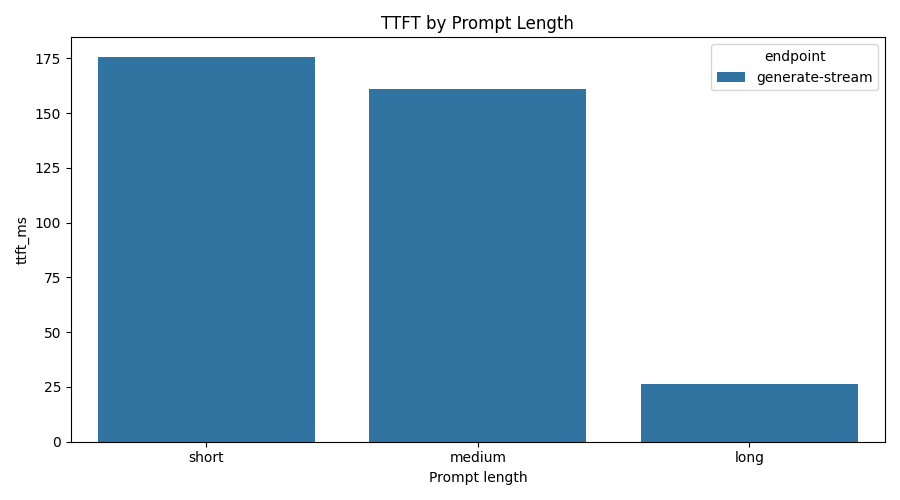
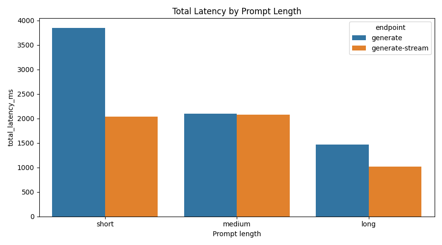
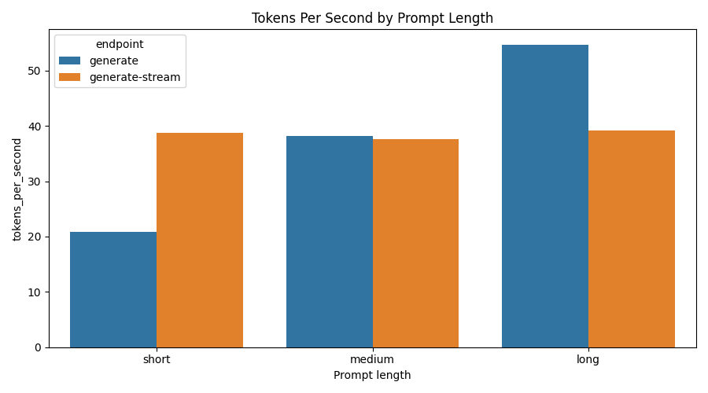

# LLM TTFT Optimization Platform

A Dockerized FastAPI service for measuring and improving **Time To First Token (TTFT)** in local LLM inference.

This project is intentionally scoped as a two-week, hiring-manager-friendly MVP: it focuses on inference APIs, streaming, latency instrumentation, reproducible benchmarks, tests, Docker, and clear benchmark charts.

## Business Problem

LLM applications can feel slow even when total generation time is acceptable. For chat and assistant products, the first visible token strongly affects perceived responsiveness. This project benchmarks TTFT, total latency, and tokens/sec across prompt lengths and response modes so an ML engineer can reason about latency-quality trade-offs instead of guessing.

## What This Project Demonstrates

- FastAPI model serving
- Streaming and non-streaming generation endpoints
- TTFT, total latency, and tokens/sec measurement
- Reproducible benchmark scripts
- Dockerized local deployment
- pytest validation for API contracts and metrics
- Interactive Plotly benchmark dashboard

## Architecture

```text
Client / Benchmark Script
        |
        v
FastAPI Service
        |
        v
Hugging Face Causal LM
        |
        v
Latency Metrics
TTFT | total latency | tokens/sec | token counts
        |
        v
Benchmark CSV
        |
        v
Charts + Analysis
```

## Quickstart

```bash
python3 -m venv .venv
source .venv/bin/activate
make install
make run
```

Then open:

```text
http://localhost:8000/docs
```

## Docker

```bash
docker compose up --build
```

## API Examples

Health check:

```bash
curl http://localhost:8000/health
```

Generate:

```bash
curl -X POST http://localhost:8000/generate \
  -H "Content-Type: application/json" \
  -d '{"prompt":"Explain TTFT in one paragraph.","max_new_tokens":60}'
```

Stream:

```bash
curl -N -X POST http://localhost:8000/generate-stream \
  -H "Content-Type: application/json" \
  -d '{"prompt":"Explain why LLM streaming improves user experience.","max_new_tokens":60}'
```

## Benchmarking

Start the API, then run:

```bash
make benchmark
make plots
make dashboard
```

Outputs:

```text
benchmark_results/results.csv
plots/ttft_by_prompt_length.png
plots/total_latency_by_prompt_length.png
plots/tokens_per_second.png
dashboard/index.html
```

Open the benchmark dashboard in your browser:

```text
dashboard/index.html
```

The dashboard uses Plotly for interactive charts, hover tooltips, grouped endpoint
comparisons, and request-level latency inspection.

This project intentionally uses a generated static dashboard rather than a full frontend
framework. That keeps the first version reproducible and focused on ML engineering. A
React/Next.js frontend would make sense later if the project needs run filtering, saved
experiments, model comparison pages, or live monitoring views.

## Benchmark Snapshot

The current checked-in charts come from a small local benchmark run using `distilgpt2`
on Apple MPS. Treat these as sample results that prove the pipeline works; for a final
portfolio submission, rerun the benchmark with more repetitions and update the charts.

| Metric | Value |
| --- | ---: |
| Benchmark requests | 6 |
| Mean total latency | 2,089.7 ms |
| Streaming p95 TTFT | 174.3 ms |
| Mean throughput | 38.2 tokens/sec |

## Visualizations

### TTFT By Prompt Length

This chart focuses on the streaming endpoint because TTFT only exists when tokens are
returned incrementally.



### Total Latency By Prompt Length

This compares end-to-end latency for standard generation versus streaming generation.



### Tokens Per Second

This tracks generation throughput across prompt sizes and response modes.



## Refreshing The Results

To regenerate the benchmark data, static charts, and Plotly dashboard:

```bash
make run
```

In another terminal:

```bash
make benchmark
make plots
make dashboard
```

## Testing

```bash
make test
make lint
```

## Initial Scope

Included:

- `/health`
- `/generate`
- `/generate-stream`
- TTFT metrics
- CSV benchmarks
- latency plots
- Docker setup
- tests

Deferred intentionally:

- LoRA fine-tuning
- vLLM
- cloud deployment
- MLflow
- Prometheus/Grafana

These are good phase-two improvements after the core latency story is working.
